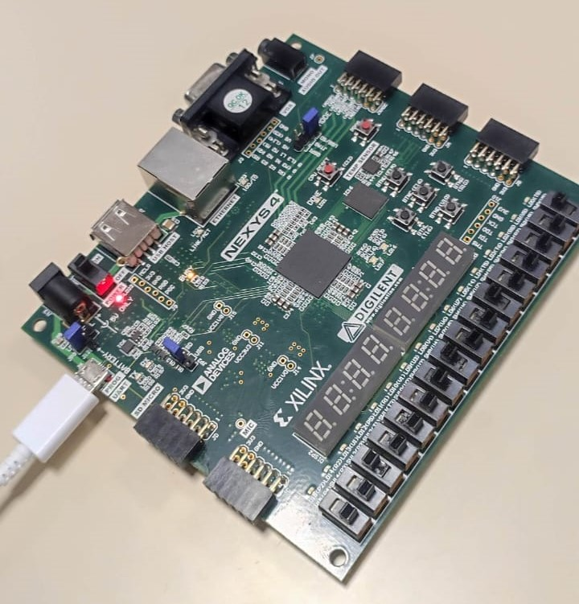
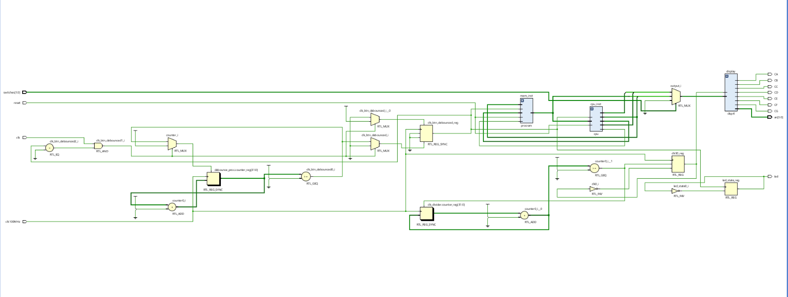

# Basic FPGA Microprocessor on Nexys4DDR - Project 

## Project Overview
This project involves creating a basic microprocessor on an FPGA platform, specifically the Nexys4DDR board.

    

### Components
- **cpu_top.vhd**: Top-level entity integrating the CPU, RAM, and display modules.
- **cpu.vhd**: CPU core executing instructions.
- **disp4.vhd**: Manages the Nexys4DDR board's 7-segment display.
- **procram.vhd**: Simulates RAM for data storage and retrieval.

### Functionality
Executes basic operations like load, store, add, and jump based on opcodes.

### Clocks
Uses a debounced clock for inputs and a divided clock for display operations.

## Implementation Steps
1. **Environment Setup**: Initialize your FPGA development environment.
2. **Configure Constraints**: Apply `.xdc` constraints for the Nexys4DDR board.
3. **Synthesis**: Compile VHDL files and synthesize the design.
4. **Simulation**: Use testbench to verify functionality.
5. **Board Programming**: Load the bitstream onto the Nexys4DDR.
6. **Operation**: Observe instruction execution on the 7-segment display.

## Files Explanation
Each VHDL file contains comments for a better understanding of the system.

 
Details are in our report RTIC_project.pdf
